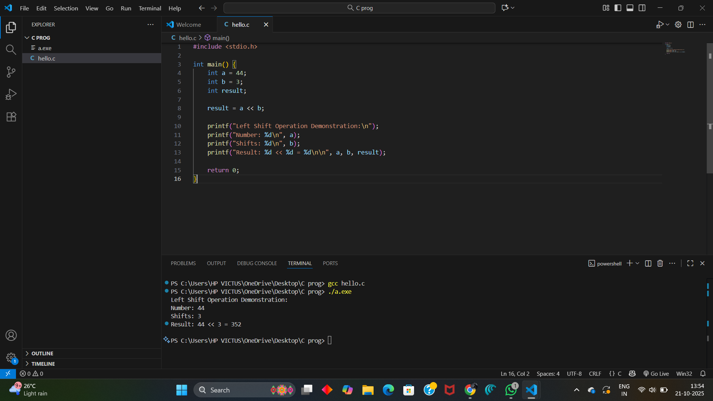
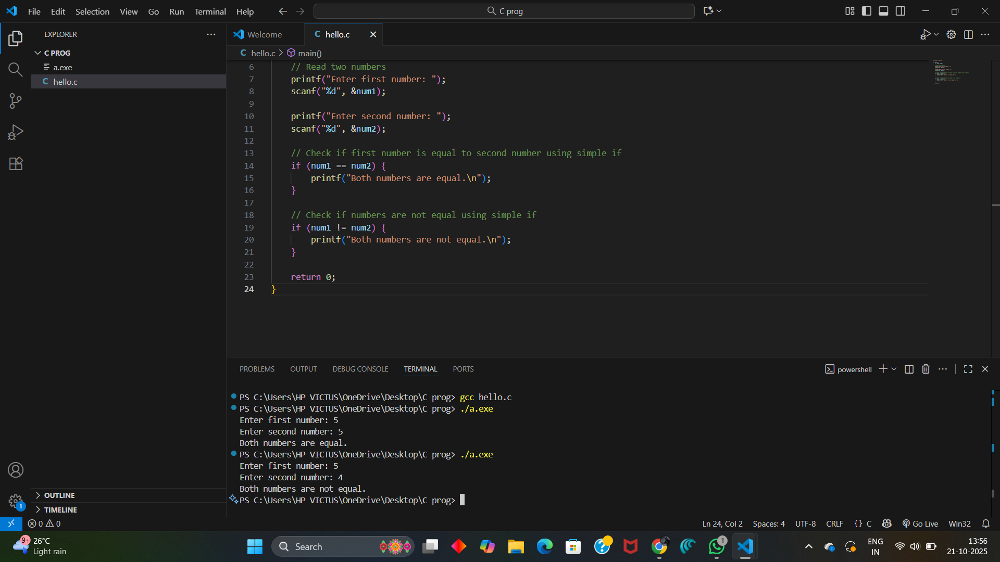
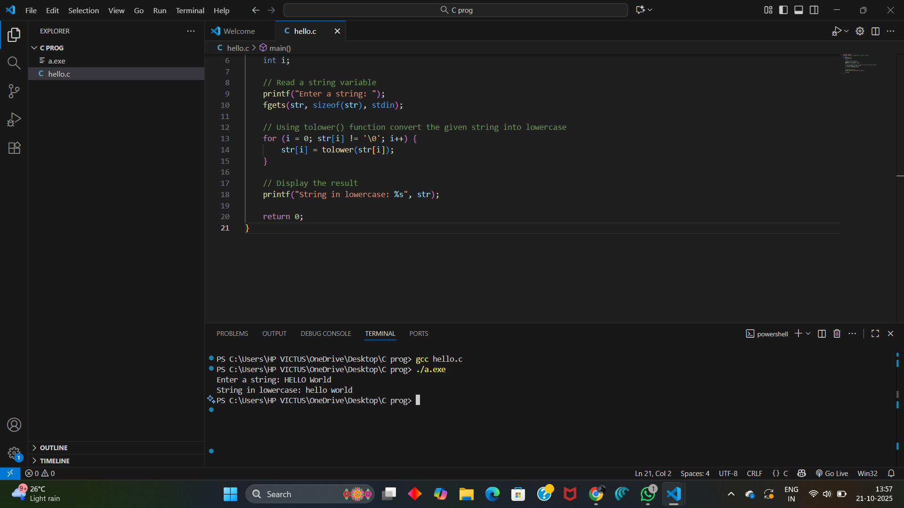
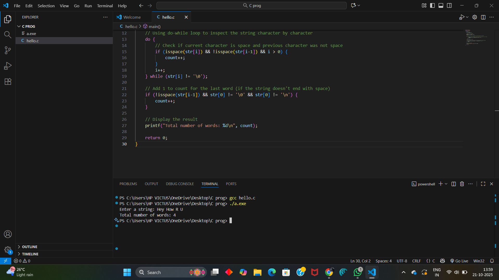
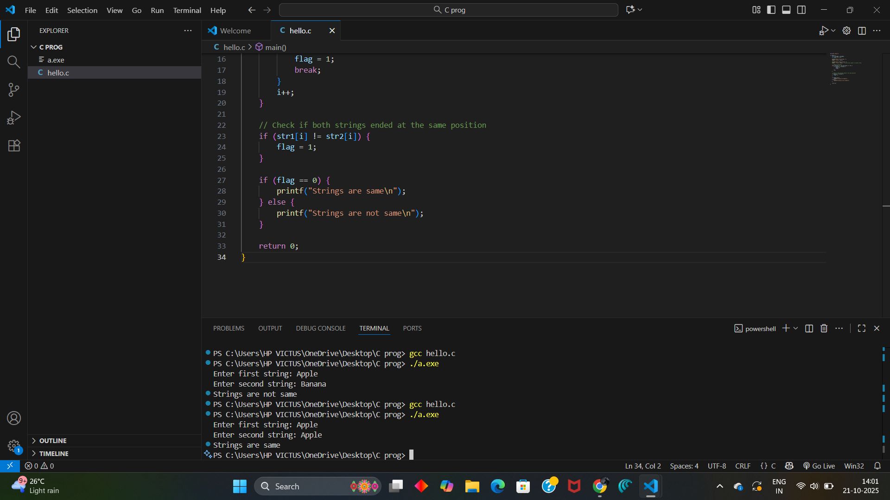

# EX-16-LEFT-SHIFT-OPERATION
## AIM
To write a C Program to perform the basic left shift operation for 44 integer number with 3 shifts.

## ALGORITHM
1.	Start the program.
2.	Assign values of a and b as 44 and 3.
3.	Use left shift operator (<<) and shift the value of a three times.
4.	Display the result.
5.	Stop the program.

## PROGRAM
```
#include <stdio.h>

int main() {
    int a = 44;
    int b = 3;
    int result;
    
    result = a << b;
    
    printf("Left Shift Operation Demonstration:\n");
    printf("Number: %d\n", a);
    printf("Shifts: %d\n", b);
    printf("Result: %d << %d = %d\n\n", a, b, result);
 
    return 0;
}
```

## OUTPUT




## RESULT
Thus the program to perform the basic left shift operation for 44 integer number with 3 shifts has been executed successfully.


 
 


# EX-17-TWO-NUMBERS-ARE-EQUAL-OR-NOT


## AIM

Write a C Program to check whether the two numbers are equal or not using simple if statement.

## ALGORITHM

1.	Start the program.
2.	Read two numbers.
3.	If first number is equal to second number, display both are equal.
4.	Otherwise display both are not equal.
5.	Stop the program.

## PROGRAM
```
#include <stdio.h>

int main() {
    int num1, num2;
    
    // Read two numbers
    printf("Enter first number: ");
    scanf("%d", &num1);
    
    printf("Enter second number: ");
    scanf("%d", &num2);
    
    // Check if first number is equal to second number using simple if
    if (num1 == num2) {
        printf("Both numbers are equal.\n");
    }
    
    // Check if numbers are not equal using simple if
    if (num1 != num2) {
        printf("Both numbers are not equal.\n");
    }
    
    return 0;
}
```


## OUTPUT
           
## RESULT

Thus the program to check whether the two numbers are equal or not using simple if statement has been executed successfully
 
 


# EX-18-STRING-LOWERCASE-CONVERSION
## AIM
Write a C Program to convert the given string into lowercase.

## ALGORITHM
1.	Start the program.
2.	Read a string variable.
3.	Using tolower( ) function convert the given string into its lowercase.
4.	Display the result.
5.	Stop the program.

## PROGRAM
```
#include <stdio.h>
#include <ctype.h>  // Required for tolower() function

int main() {
    char str[100];
    int i;
    
    // Read a string variable
    printf("Enter a string: ");
    fgets(str, sizeof(str), stdin);
    
    // Using tolower() function convert the given string into lowercase
    for (i = 0; str[i] != '\0'; i++) {
        str[i] = tolower(str[i]);
    }
    
    // Display the result
    printf("String in lowercase: %s", str);
    
    return 0;
}
```

## OUTPUT




## RESULT
Thus the program to convert the given string into lowercase has been executed successfully
 
 


# EX-19-COUNT-OF-WORDS-IN-A-STRING
## AIM
Write a C Program to count the total number of words in a given string using do While loop.

## ALGORITHM
1.	Start the program.
2.	Read a string variable.
3.	Using for loop, inspect the string character by character.
4.	Whenever a space is encountered increment count by 1.
5.	Display the result.
6.	Stop the program.

## PROGRAM
```
#include <stdio.h>
#include <ctype.h>

int main() {
    char str[100];
    int i = 0, count = 0;
    
    // Read a string variable
    printf("Enter a string: ");
    fgets(str, sizeof(str), stdin);
    
    // Using do-while loop to inspect the string character by character
    do {
        // Check if current character is space and previous character was not space
        if (isspace(str[i]) && !isspace(str[i-1]) && i > 0) {
            count++;
        }
        i++;
    } while (str[i] != '\0');
    
    // Add 1 to count for the last word (if the string doesn't end with space)
    if (!isspace(str[i-1]) && str[0] != '\0' && str[0] != '\n') {
        count++;
    }
    
    // Display the result
    printf("Total number of words: %d\n", count);
    
    return 0;
}
```

## OUTPUT



## RESULT
Thus the program to count the total number of words in a given string using do While loop has been executed successfully
 
 


# EX  -20 -COMPARING TWO STRINGS
## AIM
write a Program to compare two strings without using strcmp().
## ALGORITHM
Step 1: Start the program.
Step 2: Declare two character arrays c1 and c2 of size 100 to store the strings. Also, declare an integer variable
             flag and initialize it to 0, and i for indexing.      
Step 3: Read the first string c1 using scanf("%[^\n]", c1); — this reads input until a newline is encountered 
            (i.e., can include spaces).
Step 4: Read the second string c2 using scanf("%s", c2); — this reads input until a space or newline (i.e., no 
            spaces in the second string).
Step 5: Start comparing characters of both strings from index i = 0.
Step 6: Repeat the following while neither c1[i] nor c2[i] is '\0' (i.e., end of string):
•	If c1[i] is not equal to c2[i], set flag = 1.
•	Increment i by 1.
Step 7: After the loop, check the value of flag:
•	If flag == 0, print "strings are same".
•	Otherwise, print "strings are not same".
Step 8: End the program.

## PROGRAM
```
#include <stdio.h>

int main() {
    char str1[100], str2[100];
    int flag = 0, i = 0;
    
    printf("Enter first string: ");
    scanf(" %[^\n]", str1);
    
    printf("Enter second string: ");
    scanf(" %[^\n]", str2);  // Also allows spaces in second string
    
    // Compare characters
    while (str1[i] != '\0' && str2[i] != '\0') {
        if (str1[i] != str2[i]) {
            flag = 1;
            break;
        }
        i++;
    }
    
    // Check if both strings ended at the same position
    if (str1[i] != str2[i]) {
        flag = 1;
    }
    
    if (flag == 0) {
        printf("Strings are same\n");
    } else {
        printf("Strings are not same\n");
    }
    
    return 0;
}
```


## OUTPUT
 

## RESULT
Thus the C Program to compare two strings without using strcmp() has been executed successfully.

